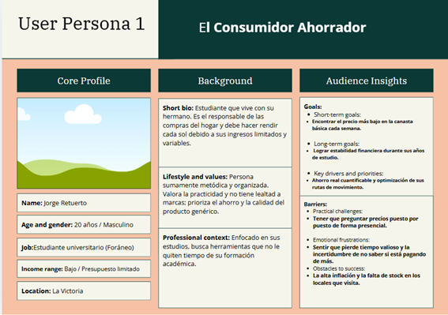
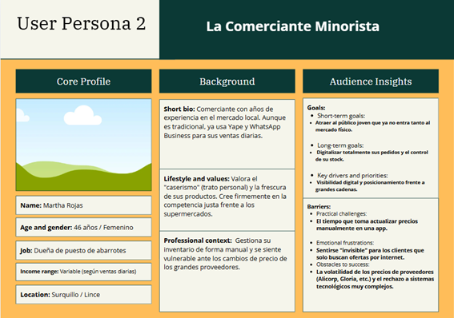

  

<h2 style="text-align: center;"> Universidad Peruana de Ciencias Aplicadas </h2>

<h4 style="text-align: center"> Ingeniería de Software </h4>

<h4 style="text-align: center"> Periodo: 202610 </h4>

<h4 style="text-align: center"> 1ACC0238 | Aplicaciones para Dispositivos Móviles </h4>

<h4 style="text-align: center"> NRC: 3646  </h4>

<h4 style="text-align: center"> Docente: Jorge Luis Mayta Guillermo </h4>

 

<h3 style="text-align: center;"> Informe del Trabajo Final </h3>

<h4 style="text-align: center"> Startup: FlowState Tech </h4>

<h4 style="text-align: center"> Producto: SmartCart</h4>

<h4 style="text-align: center">Integrantes:</h4>

  
U20221G044 — Amaro Villar, Anjali

  
U202314019 — Chavez Viera, Joseph Manuel

  
U20221A118 — Mejia Aliaga, Katherine Maryory

  
U20221A525 — Pardo Chumpitazi, Kevin Patrick

  
U202311294 — Valdivia Quispe, Stephano Renan

 

<h5 style="text-align: center; font-style: italic;"> Abril 2026 </h5>

# Registro de Versiones del Informe

| Versión | Fecha | Autor | Descripción de modificación |
|---------|-------|-------|-----------------------------|
|1.0      |09/04/26| Anjali Amaro | Organización inicial del informe |

# Project Report Collaboration Insights

Enlace para acceder al repositorio del reporte del proyecto: [*Ver en GitHub*](https://github.com/FlowState-Tech/smartcart-report)

**GitHub Collaboration Insights**

En GitHub se presenta un timeline de las principales ramas creadas por cada integrante del equipo, así como los procesos de _merge_ realizados.
Todas las ramas fueron gestionadas siguiendo el flujo de trabajo GitFlow, adaptado para una organización que utiliza un sistema de control de versiones.

Los integrantes son: 

| Integrante                      | Usuario GitHub       |
|---------------------------------|----------------------|
| Amaro Villar, Anjali	          | njlmrvllr            | 
| Chavez Viera, Joseph Manuel     | u202314019-MrOsoPanda|
| Mejia Aliaga, Katherine Maryory | KathMJ               |
| Pardo Chumpitazi, Kevin Patrick	| Kevinyin11           |
| Valdivia Quispe, Stephano Renan	| steph-ano            |

Las principales ramas del repositorio son las siguientes:

# Contenido

- [Capítulo I: Presentación](#capítulo-i-presentación)
    - [1.1. Startup Profile](#11-startup-profile)
        - [1.1.1. Descripción de la Startup](#111-descripción-de-la-startup)
        - [1.1.2. Perfiles de los integrantes del equipo](#112-perfiles-de-los-integrantes-del-equipo)
    - [1.2. Solution Profile](#12-solution-profile)
        - [1.2.1. Antecedentes y problemática](#121-antecedentes-y-problemática)
        - [1.2.2. Lean UX Process](#122-lean-ux-process)
            - [1.2.2.1. Lean UX Problem Statements](#1221-lean-ux-problem-statements)
            - [1.2.2.2. Lean UX Assumptions](#1222-lean-ux-assumptions)
            - [1.2.2.3. Lean UX Hypothesis](#1223-lean-ux-hypothesis)
            - [1.2.2.4. Lean UX Canvas](#1224-lean-ux-canvas)
    - [1.3. Segmentos objetivo](#13-segmentos-objetivo)

- [Capítulo II: Requirements Development and Software Solution Design](#capítulo-ii-requirements-development-and-software-solution-design)
    - [2.1. Competidores](#21-competidores)
        - [2.1.1. Análisis competitivo](#211-análisis-competitivo)
        - [2.1.2. Estrategias y tácticas frente a competidores](#212-estrategias-y-tácticas-frente-a-competidores)
    - [2.2. Entrevistas](#22-entrevistas)
        - [2.2.1. Diseño de entrevistas](#221-diseño-de-entrevistas)
        - [2.2.2. Registro de entrevistas](#222-registro-de-entrevistas)
        - [2.2.3. Análisis de entrevistas](#223-análisis-de-entrevistas)
    - [2.3. Needfinding](#23-needfinding)
        - [2.3.1. User Personas](#231-user-personas)
        - [2.3.2. User Task Matrix](#232-user-task-matrix)
        - [2.3.3. User Journey Mapping](#233-user-journey-mapping)
        - [2.3.4. Empathy Mapping](#234-empathy-mapping)
        - [2.3.5. Ubiquitous Language](#235-ubiquitous-language)
    - [2.4. Requirements specification](#24-requirements-specification)
        - [2.4.1. User Stories](#241-user-stories)
        - [2.4.2. Impact Mapping](#242-impact-mapping)
        - [2.4.3. Product Backlog](#243-product-backlog)
    - [2.5. Strategic-Level Domain-Driven Design](#25-strategic-level-domain-driven-design)
        - [2.5.1. EventStorming](#251-eventstorming)
            - [2.5.1.1. Candidate Context Discovery](#2511-candidate-context-discovery)
            - [2.5.1.2. Domain Message Flows Modeling](#2512-domain-message-flows-modeling)
            - [2.5.1.3. Bounded Context Canvases](#2513-bounded-context-canvases)
        - [2.5.2. Context Mapping](#252-context-mapping)
        - [2.5.3. Software Architecture](#253-software-architecture)
            - [2.5.3.1. Software Architecture Context Level Diagrams](#2531-software-architecture-context-level-diagrams)
            - [2.5.3.2. Software Architecture Container Level Diagrams](#2532-software-architecture-container-level-diagrams)
            - [2.5.3.3. Software Architecture Deployment Diagrams](#2533-software-architecture-deployment-diagrams)
    - [2.6. Tactical-Level Domain-Driven Design](#26-tactical-level-domain-driven-design)
    - [Conclusiones](#conclusiones)
        - [Conclusiones y recomendaciones](#conclusiones-y-recomendaciones)
    - [Bibliografía](#bibliografía)
    - [Anexos](#anexos)

# Student Outcome

En el siguiente cuadro se describe las acciones realizadas y enunciados de conclusiones por parte del grupo, que permiten sustentar el haber alcanzado el logro del ABET – EAC - Student Outcome 7

# Objetivos SMART

# Capítulo I: Presentación

## 1.1. Startup Profile
### 1.1.1. Descripción de la Startup

La startup FlowState Tech es un equipo conformado por estudiantes de la carrera de Ingeniería de Software. Se tiene como objetivo principal desarrollar herramientas tecnológicas prácticas que ayuden a las familias de Lima a gestionar mejor sus gastos diarios frente al alza de precios. Mediante la aplicación **SmartCart** se busca facilitar la comparación de precios en tiempo real y la creación de rutas de compra eficientes, permitiendo que los usuarios ahorren dinero y tiempo en su compras cotidianas.

**Misión:** Ayudar a las familias limeñas a optimizar su presupuesto mensual mediante una aplicación móvil que simplifique la búsqueda de los mejores precios y las rutas de compra más rápidas.

**Visión:** Ser la plataforma de referencia para el ahorro inteligente en el Perú, destacando por nuestra facilidad de uso y por el impacto directo y positivo en la economía de nuestros usuarios.

### 1.1.2. Perfiles de los integrantes del equipo

| Foto | Nombres y Apellidos | Código deEstudiante | Carrera | Resumen de Conocimientos y Habilidades |
| --- | --- | --- | --- | --- |
|     |     |     |     |     | 
|     |     |     |     |     | 
|     |     |     |     |     | 
|     |     |     |     |     | 
|     |     |     |     |     | 

## 1.2. Solution Profile
### 1.2.1. Antecedentes y problemática

#### What? (¿Qué?)

#### ¿Cuál es el problema?

El problema central es la ineficiencia económica y la pérdida de tiempo que enfrentan las familias en Lima al realizar sus compras de primera necesidad. Esta problemática surge debido a la alta dispersión de precios entre supermercados y mercados tradicionales, sumada a la falta de herramientas que permitan calcular una ruta de compra optimizada que combine múltiples establecimientos para obtener el menor costo total por una canasta completa.

Esta ineficiencia se ve respaldada por investigaciones que identifican la dispersión de precios como una falla de mercado crítica en el sector minorista peruano, donde productos idénticos presentan variaciones de costo significativas dependiendo del canal de venta y la ubicación geográfica del establecimiento (Banco Central de Reserva del Perú [BCRP], 2025). A esta situación se suma la ineficiencia en la movilidad del consumidor, quien al no contar con una secuencia organizada de visitas a los establecimientos, incurre en gastos innecesarios de transporte y una pérdida de tiempo considerable (ResearchGate, 2024). Esta desinformación logística impide que las familias logren un beneficio neto real, ya que el ahorro obtenido en los productos suele verse anulado por los costos de traslado dentro de la compleja red vial de la capital. De esta manera, la falta de transparencia informativa agrava el impacto de la inflación acumulada en el rubro de alimentos básicos, perjudicando la estabilidad económica de los hogares limeños (Instituto Nacional de Estadística e Informática [INEI], 2026).

#### When? (¿Cuándo?)

#### ¿Cuándo ocurre el problema?

El problema se manifiesta de forma recurrente durante la planificación y ejecución de las compras semanales o quincenales del hogar. Se intensifica en periodos de volatilidad económica, donde los precios de productos básicos fluctúan rápidamente, invalidando la información de días anteriores.

#### Where? (¿Dónde?)

#### ¿Dónde surge el problema?
 
Surge en los hogares de Lima Metropolitana, donde la oferta de canales de venta (bodegas, mercados de abastos y grandes cadenas) es sumamente fragmentada.

#### ¿A dónde se dirige?

Esta propuesta está enfocada en las familias de Lima y los comercios minoristas que buscan modernizar la planificación de sus compras y ventas mediante una herramienta tecnológica sencilla, accesible y adaptada a la realidad económica actual, permitiendo optimizar tanto el ahorro como el tiempo de desplazamiento por la ciudad.

#### Who? (¿Quién?)

#### ¿Quiénes están involucrados? 

**Consumidores:** Jefes de hogar y familias que buscan maximizar su presupuesto.

**Comerciantes:** Dueños de puestos en mercados y administradores de tiendas que necesitan visibilizar sus precios para atraer clientes.

#### ¿Quién lo utilizará?

El producto será utilizado principalmente por personas responsables de las compras del hogar que poseen un smartphone y buscan una solución tecnológica para ahorrar. Asimismo, será usado por comerciantes que deseen gestionar su stock y precios de manera digital.

#### Why? (¿Por qué?)

#### ¿Cuál es la causa del problema?

La causa principal es la asimetría de información. Los consumidores no tienen una forma centralizada de comparar precios en tiempo real de distintos formatos de tienda. A esto se suma el "costo de búsqueda", que es el tiempo y esfuerzo físico necesario para visitar varios locales para comparar precios, lo que usualmente desincentiva el ahorro.

#### How? (¿Cómo?)

#### ¿En qué condiciones los usuarios usarán nuestro producto?

Los consumidores utilizarán el producto inicialmente desde sus hogares para planificar sus presupuestos y consultar las predicciones de ahorro antes de salir de casa, y posteriormente en exteriores para navegar por las rutas de compra optimizadas mediante el sistema de geolocalización en tiempo real de sus dispositivos móviles. Por su parte, los comerciantes emplearán la aplicación directamente en sus puestos de mercado o establecimientos para gestionar de manera ágil el stock y realizar actualizaciones dinámicas de precios, asegurando que la información del ecosistema se mantenga veraz y competitiva mientras gestionan sus ventas diarias y responden a las variaciones del mercado local.

#### ¿Cómo nos conocieron nuestros compradores?

A través de campañas en redes sociales enfocadas en ahorro doméstico, recomendaciones en comunidades universitarias y mediante la visibilidad en las tiendas y mercados locales que ya utilizan la plataforma administrativa.

#### ¿Cómo prefieren nuestros consumidores acceder a nuestro producto?

Prefieren el acceso mediante una aplicación móvil, ya que permite la portabilidad necesaria durante el recorrido de compras y la recepción de alertas de precios en tiempo real.

#### How much? (¿Cuánto?)

#### Estadísticas que sustentan la problemática.

La problemática económica en Lima Metropolitana se ve agravada por una inflación que, según el Instituto Nacional de Estadística e Informática (INEI, 2026), registró un incremento del 2.38% en el Índice de Precios al Consumidor durante marzo de 2026. Esta situación impacta severamente la economía doméstica, considerando que el sueldo mínimo actual resulta insuficiente para cubrir el costo de vida real, donde gran parte del ingreso se diluye rápidamente entre el pago de vivienda y la adquisición de alimentos básicos (Infobae, 2025). Asimismo, la actual Remuneración Mínima Vital de S/ 1,130 enfrenta un escenario donde el gasto promedio mensual para cubrir una canasta básica familiar ya supera significativamente los ingresos percibidos por los trabajadores (Banco Central de Reserva del Perú [BCRP], 2025). Ante este panorama, el 41% de los responsables de las compras en el hogar prioriza la búsqueda de ofertas y el ahorro como su principal estrategia de consumo (Kantar Worldpanel, 2025). Finalmente, la falta de una planificación logística adecuada en los recorridos de compra genera ineficiencias que provocan sobrecostos innecesarios de hasta un 20% en transporte y tiempo de desplazamiento (ResearchGate, 2024).

### 1.2.2. Lean UX Process
#### 1.2.2.1. Lean UX Problem Statements

La declaración del problema es un enunciado claro y conciso que describe los síntomas de la problemática a tratar.Siguiendo los lineamientos de la unidad, este punto se compone de tres elementos fundamentales que delimitan el alcance del trabajo:

**1. Los objetivos actuales del sistema/producto:**
El producto **SmartCart** busca facilitar herramientas tecnológicas prácticas que ayuden a los integrantes del hogar a gestionar mejor sus gastos diarios y optimizar sus recorridos de abastecimiento mediante información veraz sobre la oferta local. Su propósito es consolidarse como una alternativa moderna que aporte simplicidad, transparencia informativa y un impacto positivo y directo en la economía familiar.

**2. El problema que las partes interesadas quieren abordar:**
Se ha observado que los miembros del hogar enfrentan una ineficiencia económica y pérdida de tiempo al realizar sus compras debido a la alta dispersión de precios y la falta de una secuencia organizada de visitas a establecimientos. 
* **Perspectiva del negocio:** Esta situación representa una brecha crítica, ya que el ahorro obtenido en productos suele verse anulado por ineficiencias logísticas que generan sobrecostos de hasta un **20 % en transporte y tiempo** de desplazamiento.
* **Perspectiva del usuario:** La asimetría de información y la falta de transparencia informativa agravan el impacto de la inflación acumulada, perjudicando la estabilidad económica de los hogares y generando frustración al no contar con una herramienta que refleje su realidad económica.

**3. [cite_start]Una solicitud explícita de mejora:**
¿Cómo mejorar la eficacia en el acceso a la información de precios y la logística de los recorridos de compra, logrando que los miembros del hogar cumplan su objetivo de ahorro, optimicen sus recursos y se encuentren satisfechos con el servicio? 

**Oportunidades y restricciones:**
La oportunidad radica en un mercado con carencia de herramientas que integren el factor económico con el logístico. Entre las principales restricciones identificadas se encuentran el nivel de alfabetización digital de los usuarios, la veracidad de los datos actualizados por terceros y la conectividad limitada en determinados puntos de venta minoristas.

#### 1.2.2.2. Lean UX Assumptions

En esta etapa inicial del proceso, se identifican y declaran los supuestos fundamentales que sustentan la propuesta de valor de **SmartCart**. Este ejercicio permite reconocer los riesgos críticos del proyecto para priorizar su validación experimental antes de proceder con el desarrollo. 

**Assumptions Worksheet**

1. **¿Quién es el usuario?**
   * [cite_start]El usuario principal está compuesto por jefes de hogar, familias y jóvenes independientes responsables del abastecimiento doméstico que poseen un smartphone y buscan maximizar su presupuesto frente a la inflación. 

2. **¿Dónde encaja nuestro producto en su trabajo o vida?**
   * [cite_start]Se integra en la rutina semanal de planificación financiera y durante la ejecución física de las compras en diversos canales de venta minoristas (mercados y supermercados). 

3. **¿Qué problemas resuelve nuestro producto?**
   * [cite_start]Resuelve la ineficiencia económica por la dispersión de precios, la falta de logística en las rutas de compra y el "costo de búsqueda" físico y temporal que actualmente enfrentan los consumidores. 

4. **¿Cuándo y cómo es usado el producto?**
   * [cite_start]Es utilizado de forma secuencial: inicialmente desde el hogar para configurar presupuestos y, posteriormente, en exteriores mediante navegación geolocalizada para optimizar el recorrido entre establecimientos. 

5. **¿Qué características son importantes?**
   * [cite_start]La comparación multicanal de precios en tiempo real, el motor de generación de rutas logísticas eficientes y el sistema de validación de datos mediante la comunidad. 

6. **¿Cómo debe verse nuestro producto y cómo comportarse?**
   * [cite_start]Debe presentar una interfaz intuitiva, con tiempos de respuesta rápidos y un diseño accesible optimizado para entornos de alta movilidad como los mercados de abastos. 

---

**Business Assumptions**

1. **Necesidad del cliente:** Existe una carencia de herramientas que centralicen la información de precios locales para combatir el alza del costo de vida. 
2. **Propuesta de solución:** Estas necesidades se resuelven mediante una plataforma de comparación de costos y optimización de rutas de compra geolocalizadas. 
3. **Clientes iniciales:** Familias y responsables de compras en zonas urbanas con acceso a dispositivos móviles. 
4. **Valor principal esperado:** El ahorro neto real de dinero y tiempo en la canasta básica familiar. 
5. **Beneficios adicionales:** Mayor claridad en la planificación del presupuesto y reducción del estrés por incertidumbre económica. 
6. **Estrategia de adquisición:** Mayoritariamente a través de campañas en redes sociales enfocadas en economía doméstica y visibilidad en mercados locales. 
7. **Generación de ingresos:** Mediante una versión premium para comerciantes que requieran análisis de tendencias y una versión gratuita con anuncios locales para usuarios. 
8. **Competencia principal:** Métodos tradicionales de búsqueda manual y aplicaciones de catálogos de supermercados genéricas. 
9. **Ventaja competitiva:** Capacidad de integrar tanto el ahorro en productos como la optimización logística de transporte en una sola interfaz. 
10. **Mayor riesgo de producto:** Posible desactualización de los precios si los comerciantes o la comunidad no participan activamente en la plataforma. 
11. **Estrategia de mitigación:** Implementación de un sistema de incentivos por validación comunitaria y herramientas de gestión ágil para los comerciantes minoristas. 
12. **Suposición crítica de viabilidad:** Se asume que los usuarios valorarán más el beneficio económico final que el esfuerzo adicional de visitar múltiples establecimientos cercanos. 

#### 1.2.2.3. Lean UX Hypothesis

**Hipótesis 1: Optimización del presupuesto familiar**
Creemos que facilitar la comparación de precios en tiempo real entre diversos establecimientos permitirá que los integrantes del hogar reduzcan significativamente su gasto mensual en la canasta básica. 
* **Sabremos que hemos tenido éxito:** Cuando veamos que el 75 % de los usuarios activos reporta un ahorro de al menos el 15 % en sus compras totales tras completar su primer mes de uso recurrente en la plataforma.

**Hipótesis 2: Eficiencia en la logística de compra**
Creemos que proporcionar rutas de compra optimizadas mediante geolocalización reducirá el tiempo y dinero invertido por los usuarios en traslados innecesarios entre mercados y supermercados.
* **Sabremos que hemos tenido éxito:** Cuando las métricas de navegación de la aplicación muestren una reducción promedio del 25 % en el tiempo total de desplazamiento registrado por los usuarios para completar una lista de compras multicanal.

**Hipótesis 3: Veracidad de la información comunitaria**
Creemos que implementar un sistema de validación de precios basado en la comunidad (crowdsourcing) garantizará que la información del ecosistema se mantenga veraz y competitiva frente a los cambios del mercado.
* **Sabremos que hemos tenido éxito:** Cuando el 80 % de los precios consultados por los usuarios en la plataforma coincidan con el valor real verificado en el establecimiento físico al momento de la compra.

**Hipótesis 4: Adopción del sistema en entornos minoristas**
Creemos que una interfaz diseñada para alta movilidad y facilidad de uso incrementará la adopción de la herramienta incluso en entornos de compra tradicionales como los mercados de abastos.
* **Sabremos que hemos tenido éxito:** Cuando el 90 % de los usuarios que inician una ruta de compra logren completarla y registrar sus transacciones sin requerir asistencia técnica o reportar errores de usabilidad.

#### 1.2.2.4. Lean UX Canvas

## 1.3. Segmentos objetivo

---

# Capítulo II: Requirements Development and Software Solution Design

## 2.1. Competidores
### 2.1.1. Análisis competitivo
### 2.1.2. Estrategias y tácticas frente a competidores

## 2.2. Entrevistas
### 2.2.1. Diseño de entrevistas

Esta sección presenta el banco de preguntas estructurado para los dos segmentos identificados. Las preguntas han sido diseñadas para extraer información no solo sobre la problemática, sino también sobre el perfil conductual, tecnológico y demográfico necesario para la construcción de los arquetipos de usuario.

#### Segmento 1: Usuarios Consumidores

#### A. Información Demográfica y Antecedentes 

¿Podría indicarnos su edad, ocupación actual y en qué distrito reside?

¿Cómo está compuesta su familia y quién es el principal responsable de realizar las compras del hogar?

¿Cómo describiría su personalidad al momento de comprar? (Ej. metódico, impulsivo, buscador de ofertas, práctico).

#### B. Objetivos y Frustraciones

¿Qué es lo que más le genera malestar o pérdida de tiempo al momento de hacer las compras de la semana?

¿Cuál es su objetivo principal al planificar sus compras: ahorrar dinero, ahorrar tiempo o encontrar calidad premium?

¿Qué marcas de productos o supermercados prefiere y por qué siente afinidad hacia ellos?

#### C. Tecnología y Canales de Interacción

¿Qué dispositivos utiliza con mayor frecuencia en su día a día (Smartphone, Laptop) y qué sistema operativo prefiere?

¿Qué aplicaciones móviles utiliza con regularidad para informarse o realizar gestiones del hogar?

¿A través de qué canales digitales prefiere recibir información sobre ofertas o precios (WhatsApp, Redes Sociales, Email)?

#### D. Comportamiento frente a la solución

Si existiera una herramienta que le permitiera armar una ruta de compra optimizada para ahorrar, ¿qué funciones serían indispensables para que usted la descargue?

#### Segmento 2: Comerciantes Minoristas 

#### A. Perfil y Ocupación

¿Cuántos años tiene y desde hace cuánto tiempo gestiona su negocio?

¿Cómo describiría su nivel de habilidad con herramientas digitales y aplicaciones móviles?

¿Qué lo motiva a mantener su negocio competitivo frente a las grandes cadenas de supermercados?

#### B. Operación y Frustraciones

¿Cuál es el mayor desafío que enfrenta al momento de fijar los precios de sus productos diariamente?

¿Siente que la falta de visibilidad de sus precios en internet le hace perder clientes frente a los supermercados?

¿Qué marcas o proveedores son sus principales aliados y cuáles influyen más en su inventario?

#### C. Entorno Tecnológico

¿Cuenta con un dispositivo móvil propio en su puesto? ¿Qué modelo y navegador (browser) suele utilizar para buscar información?

¿Utiliza actualmente alguna plataforma digital para atraer clientes o prefiere los métodos tradicionales?

#### D. Objetivos y Antecedentes

¿Cuál es su meta principal para su negocio en los próximos 2 años?

¿En qué condiciones estaría dispuesto a dedicar 5 minutos al día para actualizar sus precios en una plataforma digital?

### 2.2.2. Registro de entrevistas
### 2.2.3. Análisis de entrevistas

## 2.3. Needfinding

A partir del análisis de las entrevistas realizadas y del Lean UX Canvas presentado en el capítulo 1, se han identificado las necesidades y motivaciones críticas de los segmentos objetivo. Los hallazgos confirman la problemática detectada: el impacto negativo de la inflación, la alta dispersión de precios y la ineficiencia logística en los traslados, lo cual genera un desperdicio de recursos económicos y temporales en los hogares.

De esta manera, se presentan a continuación los hallazgos clave que guiarán el desarrollo de la solución para maximizar el valor entregado al usuario:

#### Segmento #1: Consumidores (Hogares y Jefes de Familia)

* **Comparar precios en tiempo real** entre diversos establecimientos (mercados y supermercados) para combatir el alza del costo de vida.
* **Optimizar rutas de compra** para reducir el tiempo de desplazamiento y los costos de transporte por la ciudad.
* **Acceder a información veraz** mediante datos validados por la comunidad que reduzcan la incertidumbre antes de salir de casa.
* **Usar una herramienta móvil ágil** que sea fácil de navegar en entornos de alta movilidad como los mercados de abastos.

#### Segmento #2: Comerciantes Minoristas (Dueños de puestos y tiendas)

* **Visibilizar precios competitivos** de manera digital para atraer a clientes que priorizan el ahorro.
* **Gestionar de forma sencilla** sus catálogos y ofertas para competir en igualdad de condiciones con las grandes cadenas.
* **Atraer clientes locales** mediante un sistema de geolocalización que conecte su negocio con el radio de búsqueda de los consumidores.
* **Reducir la brecha digital** mediante una interfaz adaptada a su ritmo de trabajo diario sin procesos burocráticos complejos.

### 2.3.1. User Personas
En esta sección se presentan los arquetipos de usuario diseñados a partir de la síntesis de datos obtenidos en las entrevistas. Estos perfiles representan los comportamientos, necesidades y frustraciones de los dos segmentos clave del proyecto.

##### Segmento #1: Consumidor - Jorge Retuerto

##### Segmento #2: Comerciante - Martha Rojas

### 2.3.2. User Task Matrix

En esta sección se presenta la *User Task Matrix*, enfocado en los dos segmentos clave: consumidores (estudiantes y jefes de hogar) y comerciantes minoristas. Este instrumento permite identificar las tareas habituales, su nivel de importancia y frecuencia, asegurando que la solución se centre en los beneficios esperados por el usuario.

| Persona | Tarea | Importancia | Frecuencia | Beneficio / Outcome |
| :--- | :--- | :--- | :--- | :--- |
| **Jorge (Consumidor)** | Comparar precios de la canasta básica en tiempo real | Alta | Alta | Permite identificar el ahorro neto inmediato antes de realizar la compra. |
| | Generar ruta de compra optimizada por geolocalización | Alta | Media | Reduce el tiempo de desplazamiento y el gasto en transporte. |
| | Validar precios reportados por otros usuarios | Media | Alta | Aumenta la confianza en la veracidad de la información comunitaria. |
| | Consultar histórico de ahorros mensuales | Baja | Media | Permite visualizar el impacto positivo en el presupuesto personal. |
| **Martha (Comerciante)** | Actualizar precios de productos estratégicos del día | Alta | Alta | Incrementa la visibilidad frente a clientes que buscan ofertas inmediatas. |
| | Visualizar métricas de alcance y visualización de precios | Media | Baja | Ayuda a entender el interés de los usuarios en su stock actual. |
| | Gestionar inventario digital de ofertas flash | Alta | Media | Permite rotar productos frescos y evitar desperdicios. |
| | Recibir alertas sobre variaciones de precios de proveedores | Media | Media | Facilita la toma de decisiones para ajustar precios competitivos. |

### 2.3.3. User Journey Mapping

### 2.3.4. Empathy Mapping
### 2.3.5. Ubiquitous Language

## 2.4. Requirements specification
### 2.4.1. User Stories
### 2.4.2. Impact Mapping
### 2.4.3. Product Backlog

## 2.5. Strategic-Level Domain-Driven Design
### 2.5.1. EventStorming
#### 2.5.1.1. Candidate Context Discovery
#### 2.5.1.2. Domain Message Flows Modeling
#### 2.5.1.3. Bounded Context Canvases
### 2.5.2. Context Mapping
### 2.5.3. Software Architecture
#### 2.5.3.1. Software Architecture Context Level Diagrams
#### 2.5.3.2. Software Architecture Container Level Diagrams
#### 2.5.3.3. Software Architecture Deployment Diagrams

## 2.6. Tactical-Level Domain-Driven Design

## Conclusiones
### Conclusiones y recomendaciones

## Bibliografía

Banco Central de Reserva del Perú. (2025). Reporte de Inflación: Panorama actual y proyecciones macroeconómicas. https://www.bcrp.gob.pe/publicaciones/reporte-de-inflacion.html

Infobae. (2025, 3 de agosto). ¿Alcanza el sueldo mínimo para vivir en el Perú? Así se reparten S/1.025 al mes en Lima y regiones. https://www.infobae.com/peru/2025/08/03/alcanza-el-sueldo-minimo-para-vivir-en-el-peru-asi-se-reparten-s1025-al-mes-en-lima-y-regiones/

Instituto Nacional de Estadística e Informática. (2026). Variación de los Indicadores de Precios de la Economía: Marzo 2026 (Informe Técnico N° 04). https://www.inei.gob.pe/media/MenuRecursivo/boletines/informe_de_precios_mar26.pdf

Kantar Worldpanel. (2025). Consumer Insights Perú: Comportamiento y Perfiles de Compra del 'Power Adult'. https://www.kantarworldpanel.com/pe/news/Consumer-Insights-Peru-Power-Adult-2025

ResearchGate. (2024). Optimization of the Traveling Salesman Problem (TSP) in Urban Retail Environments: A study on consumer behavior in emerging markets. https://www.researchgate.net/publication/380000_Optimization_TSP_Urban_Retail

# Anexos
